<div align="center">
  <h1>🚀 Supercharged Vector Database!</h1>

  <a href="#requirements">Requirements</a>
  &nbsp;&bull;&nbsp;
  <a href="#installation">Installation</a>
  &nbsp;&bull;&nbsp;
  <a href="#using-the-program">Using the Program</a>
  &nbsp;&bull;&nbsp;
  <a href="#request-a-feature-or-report-a-bug">Request a Feature or Report a Bug</a>
  &nbsp;&bull;&nbsp;
  <a href="#contact">Contact</a>
</div>

This repository allows you to create and search a vector database for relevant context across a wide variety of documents and then get a response from the large language model that's more accurate.  This is commonly referred to as "retrieval augmented generation" (RAG) and it drastically reduces hallucinations from the LLM!  You can watch an introductory [Video](https://www.youtube.com/watch?v=8-ZAYI4MvtA) or read a [Medium article](https://medium.com/@vici0549/search-images-with-vector-database-retrieval-augmented-generation-rag-3d5a48881de5) about the program. <br>





<div align="center">
  <h3><u>Requirements</u></h3>

```mermaid
graph TD
    %% Define Classes
    classDef inputStyle fill:#263238,stroke:#2ecc71,stroke-width:2px;
    classDef processStyle fill:#263238,stroke:#e91e63,stroke-width:2px;
    classDef outputStyle fill:#263238,stroke:#5bc0de,stroke-width:2px;
    classDef searchStyle fill:#263238,stroke:#ff9800,stroke-width:2px;
    classDef llmStyle fill:#263238,stroke:#9c27b0,stroke-width:2px;
    classDef ttsStyle fill:#263238,stroke:#3f51b5,stroke-width:2px;
    classDef minWidth width:200px;
    %% Input Files
    subgraph InputFiles [Files]
        A[.pdf, .docx, .txt, .html, .csv, .xls, .xlsx, .rtf, .odt]
        B[.png, .jpg, .jpeg, .bmp, .gif, .tif, .tiff]
        C[.mp3, .wav, .m4a, .ogg, .wma, .flac]
    end
    class InputFiles inputStyle;
    %% Processing
    subgraph Processing [Process]
        D[Extract Text]
        E[Summarize Images]
        F[Transcribe Audio]
    end
    class Processing processStyle;
    %% Output
    subgraph Output [Save]
        G[Vector Database]:::minWidth
    end
    class Output outputStyle;
    %% Search
    subgraph Search [Query]
        H[Type a Question]
        I[Record a Question]
    end
    class Search searchStyle;
    %% LLM
    subgraph LLM [Get Response from LLM]
        J[Combine Chunks & Query]
        K1[Local Models<br/>via this program]
        K2[Kobold, LM Studio or ChatGPT]
        K[Response from LLM]
        K1 --> K
        K2 --> K
    end
    class LLM llmStyle;
    %% TTS
    subgraph TTS [Speak Response]
        L[Text-to-Speech Models]
    end
    class TTS ttsStyle;
    %% Connections
    A --> D
    B --> E
    C --> F
    D --> G
    E --> G
    F --> G
    H --> G
    I --> G
    G --> J
    J --> K1
    J --> K2
    K --> L
```

| [🐍 Python 3.11](https://www.python.org/downloads/release/python-3119/) or [Python 3.12](https://www.python.org/downloads/release/python-3128/) &nbsp;&bull;&nbsp; [📁 Git](https://git-scm.com/downloads) &nbsp;&bull;&nbsp; [📁 Git LFS](https://git-lfs.com/) &nbsp;&bull;&nbsp; [🌐 Pandoc](https://github.com/jgm/pandoc/releases) &nbsp;&bull;&nbsp; [🛠️ Compiler](https://visualstudio.microsoft.com/) |
|---|

The above link downloads Visual Studio as an example.  Make sure to install the required SDKs, however.
 
> <details>
>   <summary>EXAMPLE error when no compiler installed:</summary>
>   
> </details>
> 
> <details>
>   <summary>EXAMPLE of installing the correct SDKs:</summary>
>   
> </details>

</div>

[Back to Top](#top)

<a name="installation"></a>
<div align="center"> <h2>Installation</h2></div>
  
### Step 1
Download the latest "release," extract its contents, and open the "src" folder:
  * NOTE: If you clone this repository you will get the development version, which may or may not be stable.

### Step 2
Within the ```src``` folder, create a [virtual environment](https://realpython.com/python-virtual-environments-a-primer/):
```
python -m venv .
```
### Step 3
Activate the virtual environment:
```
.\Scripts\activate
```
### Step 4
Run the setup script:
   > Only ```Windows``` is supported for now.

```
python setup_windows_.py
```

[Back to Top](#top)

<a name="using-the-program"></a>
<div align="center"> <h2>🖥️Usage🖥️</h2></div>

🔥Important🔥
* Instructions on how to use this program are being consolidated into the Ask jeeves functionality, which can be accessed from the "Ask Jeeves" menu option.  Please post an issue if in this repository if Jeeves is not giving you sufficient answers.
* To talk with Jeeves, you must first download the ```bge-small-en-v1.5``` embedding model from the ```Models Tab```.

### Activate the virtual environment and start the program
> Every time you want to use the program you must activate the virtual environment:
```
.\Scripts\activate
```
```
python gui.py
```

### Download the vector model
* Download a vector/embedding model from the ```Models Tab```.

### Selecting General Files

Select non-audio files (which can include images) within the ```Create Database``` tab by clicking the  ```Choose Files``` button.
  > It is highly recommended that you test out the different vision models before inputting images.  Just ask Jeeves how.

### Selecting Audio Files
Audio transcriptions can be put into the database to be searched; however, they must be transcribed first.  This can be done within the ```Tools Tab```.  You must do this for each indiviual audio file (batch processing is coming soon).
  > It is highly recommended to test the various ```Whisper``` model sizes as well as the ```batch``` setting **before** committng to transcription.  Ask Jeeves for how to do this.

Once the audio files are transcribed, the transcriptions will appear in the ```Create Database``` tab (represented by a .json file with the same name).

### Actually Creating The Database
* Download a vector model from the ```Models``` tab.
* Within the ```Create Database``` tab, create the database.

Ask Jeeves regarding the database creation settings.

## Query the Database
* In the ```Query Database``` tab, select the database you want to search.
* Type or record your question.
* Use the ```chunks only``` checkbox to only receive the relevant contexts.
* Select a backend: ```Local Models```, ```Kobold```, ```LM Studio``` or ```ChatGPT```.
* Click ```Submit Question```.
  * In the ```Settings``` tab, you can change multiple settings regarding querying the database.

Ask Jeeves for more details regarding query settings or the available backends.

### Deleting a Database
* The ```Manage Database``` tab allows you to view the contents of a database or delete it.

[Back to Top](#top)

<a name="request-a-feature-or-report-a-bug"></a>
## Request a Feature or Report a Bug

Feel free to report bugs or request enhancements by creating an issue on github or contacting me on the LM Studio Discord server (see below link)!

<a name="contact"></a>
<div align="center"><h3>CONTACT</h3></div>

All suggestions (positive and negative) are welcome.  "bbc@chintellalaw.com" or feel free to message me on the [LM Studio Discord Server](https://discord.gg/aPQfnNkxGC).

<br>
<div align="center">
    <a href="https://github.com/BBC-Esq/VectorDB-Plugin-for-LM-Studio/blob/main/src/Assets/example1.png" target="_blank">
        
    </a>
    <a href="https://github.com/BBC-Esq/VectorDB-Plugin-for-LM-Studio/blob/main/src/Assets/example2.png" target="_blank">
        
    </a>
    <a href="https://github.com/BBC-Esq/VectorDB-Plugin-for-LM-Studio/blob/main/src/Assets/example3.png" target="_blank">
        
    </a>
    <a href="https://github.com/BBC-Esq/VectorDB-Plugin-for-LM-Studio/blob/main/src/Assets/example4.png" target="_blank">
        
    </a>
      </a>
    <a href="https://github.com/BBC-Esq/VectorDB-Plugin-for-LM-Studio/blob/main/src/Assets/example5.png" target="_blank">
        
    </a>
</div>
