<div align="center">
  <h1>🚀 Supercharged Vector Database!</h1>

  <a href="#requirements">Requirements</a>
  &nbsp;&bull;&nbsp;
  <a href="#installation">Installation</a>
  &nbsp;&bull;&nbsp;
  <a href="#using-the-program">Using the Program</a>
  &nbsp;&bull;&nbsp;
  <a href="#request-a-feature-or-report-a-bug">Request a Feature or Report a Bug</a>
  &nbsp;&bull;&nbsp;
  <a href="#contact">Contact</a>
</div>

This repository allows you to create and search a vector database for relevant context across a wide variety of documents and then get a response from the large language model that's more accurate.  This is commonly referred to as "retrieval augmented generation" (RAG) and it drastically reduces hallucinations from the LLM!  You can watch an introductory [Video](https://www.youtube.com/watch?v=8-ZAYI4MvtA) or read a [Medium article](https://medium.com/@vici0549/search-images-with-vector-database-retrieval-augmented-generation-rag-3d5a48881de5) about the program. <br>





<div align="center">
  <h3><u>Requirements</u></h3>

```mermaid
graph TD
    %% Define Classes
    classDef inputStyle fill:#263238,stroke:#2ecc71,stroke-width:2px;
    classDef processStyle fill:#263238,stroke:#e91e63,stroke-width:2px;
    classDef outputStyle fill:#263238,stroke:#5bc0de,stroke-width:2px;
    classDef searchStyle fill:#263238,stroke:#ff9800,stroke-width:2px;
    classDef llmStyle fill:#263238,stroke:#9c27b0,stroke-width:2px;
    classDef ttsStyle fill:#263238,stroke:#3f51b5,stroke-width:2px;
    classDef minWidth width:200px;

    %% Input Files
    subgraph InputFiles [Files]
        A[.pdf, .docx, .txt, .html, .csv, .xls, .xlsx, .rtf, .odt]
        B[.png, .jpg, .jpeg, .bmp, .gif, .tif, .tiff]
        C[.mp3, .wav, .m4a, .ogg, .wma, .flac]
    end
    class InputFiles inputStyle;

    %% Processing
    subgraph Processing [Process]
        D[Extract Text]
        E[Summarize Images]
        F[Transcribe Audio]
    end
    class Processing processStyle;

    %% Output
    subgraph Output [Save]
        G[Vector Database]:::minWidth
    end
    class Output outputStyle;

    %% Search
    subgraph Search [Query]
        H[Type a Question]
        I[Record a Question]
    end
    class Search searchStyle;

    %% LLM
    subgraph LLM [Get Response from LLM]
        J[Assemble Chunks & Query]
        K1[Local Models]
        K2[LM Studio]
        K3[OpenAI and others<br/>coming soon]
        K[Response from LLM]
        K1 --> K
        K2 --> K
        K3 --> K
    end
    class LLM llmStyle;

    %% TTS
    subgraph TTS [Speak Response]
        L[Text-to-Speech Models]
    end
    class TTS ttsStyle;

    %% Connections
    A --> D
    B --> E
    C --> F

    D --> G
    E --> G
    F --> G

    H --> G
    I --> G

    G --> J
    J --> K1
    J --> K2
    J --> K3
    K --> L

```

| [🐍 Python 3.11](https://www.python.org/downloads/release/python-3119/) or [Python 3.12](https://www.python.org/downloads/release/python-3128/) &nbsp;&bull;&nbsp; [📁 Git](https://git-scm.com/downloads) &nbsp;&bull;&nbsp; [📁 Git LFS](https://git-lfs.com/) &nbsp;&bull;&nbsp; [🌐 Pandoc](https://github.com/jgm/pandoc/releases) &nbsp;&bull;&nbsp; [🛠️ Compiler](https://visualstudio.microsoft.com/) |
|---|

The above link downloads Visual Studio as an example.  Make sure to install the required SDKs, however.
 
> <details>
>   <summary>EXAMPLE error when no compiler installed:</summary>
>   
> </details>
> 
> <details>
>   <summary>EXAMPLE of installing the correct SDKs:</summary>
>   
> </details>

</div>

[Back to Top](#top)

<a name="installation"></a>
<div align="center"> <h2>Installation</h2></div>
  
### Step 1
Download the latest "release," extract its contents, and open the "src" folder:
  * NOTE: If you clone this repository you will get the development version, which may or may not be stable.

### Step 2
Within the ```src``` folder, create a [virtual environment](https://realpython.com/python-virtual-environments-a-primer/):
```
python -m venv .
```
### Step 3
Activate the virtual environment:
```
.\Scripts\activate
```
### Step 4
Run the setup script:
   > Only ```Windows``` is supported for now.

If using Python 3.11
```
python setup_windows_cp311.py
```
If using Python 3.12
```
python setup_windows_cp312.py
```

### Step 5 - 🔥IMPORTANT🔥
In order to use the Ask Jeeves functionality you must:
1) Go into the ```Assets``` folder;
2) Right click on ```koboldcpp_nocuda.exe```;
3) Check the "Unblock" checkbox
4) Click OK.


If the "unblock" checkbox is not visible for whatever reason, another option is to doubleclick ```koboldcpp_nocuda.exe```, select the ```.gguf``` file within the ```Assets``` directory, and start the program.  This should (at least on Windows) attempt to start the Kobold program, which will trigger an option to "allow" it and/or create an exception to "Windows Defender" on your computer.  Select "Allow" or whatever other message you receive, which will enable it for all future interactions.  Please note that you should do this before trying to run the ```Ask Jeeves``` functionality in this program; otherwise, it may not work.
  > Submit a Github ```Issue``` if you encounter any problems as ```Ask Jeeves``` is a relatively new feature.

[Back to Top](#top)

<a name="using-the-program"></a>
<div align="center"> <h3>🖥️Usage🖥️</h3></div>

> 🔥Important🔥 for more detailed instructions just Ask Jeeves!

### Activate the virtual environment and start the program
> Every time you want to use the program you must activate the virtual environment:
```
.\Scripts\activate
```
```
python gui.py
```

### Download the vector model
* Select and download a vector/embedding model from the ```Models Tab```.

### Create a vector database
This program extracts the text from a variety of file types and puts them into the vector database.  It also allows you to create summarizes of images and transcriptions of audio files to be put into the database.

### Entering General File Types

In the ```Create Database``` tab, select files you want to add to the database.  You can click the ```Choose Files``` button as many times as you want.

### Entering Images
This program uses "vision" models to create summaries of images, which can then be entered into the database and searched.  Before inputting images, I highly recommend that you test the various vision models for the one you like the most.

To test a vision model:
1) From the ```Create Database``` tab, select one or more images.
2) From the ```Settings``` tab, select the vision model you want to test.
3) From the ```Tools``` tab, process the images.

After determining which vision model you like, add images to the database by selecting them from the ```Create Database``` tab like any other file.  When you eventually create the database they will be automatically processed.

### Entering Audio Files
Audio files can be transcribed and put into the database to be searched.  Before transcribing a long audio file, I highly recommend testing the various ```Whisper``` models on a shorter audio file as well as experimenting with different ```batch``` settings.  Your goal should be to use as large of a ```Whisper``` model as your GPU supports and then adjust the batch size to keep the VRAM usage within your available VRAM.

To test optimal settings:
1) Within the ```Tools``` tab, select a short audio file.
2) Select a ```Whisper``` model.
3) Process the audio file.
4) Within the ```Create Database``` tab, doubleclick the transcription that was just created.
5) Skim the ```page content``` field to get a sense of whether the transcription is accurate enough for your use-case or if you need to selecta more accurate ```Whisper``` model.

Once you've obtained the optimal settings for your system, it's time to transcribe an audio file into the database:
1) Within the ```Create Database``` tab, delete any transcriptions you don't want entered into the database.
2) Create new transcriptions you want entered (repeate for multiple files).
   > Batch processing is not yet available.

### Actually Creating The Database
* Download a vector model from the ```Models``` tab.
* Within the ```Create Database``` tab, create the database.

### Manging the Database
* The ```Manage Database``` tab allows you to view the contents of all databases that you've created and delete them if you want.

## Query a Database (No LM Studio)
* In the ```Query Database``` tab, select the database you want to use from the pulldown menu.
* Enter your question by typing it or using the ```Record Question``` button.
* Check the ```chunks only``` checkbox to only receive the relevant contexts.
* Click ```Submit Question```.
  * In the ```Settings``` tab, you can change multiple settings regarding querying the database.  More information can be found in the User Guide.

## Query a Database with a Response From LM Studio
This program gets relevant chunks from the vector database and forwarding them - along with your question - to LM Studio for an answer!
* Perform the above steps regarding entering a question and choosing settings, but make sure that ```Chunks Only``` is 🔥UNCHECKED🔥.
* Start LM Studio and go to the Server tab on the left.
* Load a model.
* Turn ```Apply Prompt Formatting``` to "OFF."
* On the right side within ```Prompt Format```, make sure that all of the following settings are blank:
  * ```System Message Prefix```
  * ```System Message Suffix```
  * ```User Message Prefix```
  * ```User Message Suffix```
* At the top, load a model within LM Studio.
* On the right, adjust the ```GPU Offload``` setting to your liking.
* Within my program, go to the ```Settings``` tab, select the appropriate prompt format for the model loaded in LM Studio, click ```Update Settings```.
* In LM Studio,  click ```Start Server.```
* In the ```Query Database``` tab, click ```Submit Question```.

</details>

[Back to Top](#top)

<a name="request-a-feature-or-report-a-bug"></a>
## Request a Feature or Report a Bug

Feel free to report bugs or request enhancements by creating an issue on github or contacting me on the LM Studio Discord server (see below link)!

<a name="contact"></a>
<div align="center"><h3>CONTACT</h3></div>

All suggestions (positive and negative) are welcome.  "bbc@chintellalaw.com" or feel free to message me on the [LM Studio Discord Server](https://discord.gg/aPQfnNkxGC).

<br>
<div align="center">
    <a href="https://github.com/BBC-Esq/VectorDB-Plugin-for-LM-Studio/blob/main/src/Assets/example1.png" target="_blank">
        
    </a>
    <a href="https://github.com/BBC-Esq/VectorDB-Plugin-for-LM-Studio/blob/main/src/Assets/example2.png" target="_blank">
        
    </a>
    <a href="https://github.com/BBC-Esq/VectorDB-Plugin-for-LM-Studio/blob/main/src/Assets/example3.png" target="_blank">
        
    </a>
    <a href="https://github.com/BBC-Esq/VectorDB-Plugin-for-LM-Studio/blob/main/src/Assets/example4.png" target="_blank">
        
    </a>
      </a>
    <a href="https://github.com/BBC-Esq/VectorDB-Plugin-for-LM-Studio/blob/main/src/Assets/example5.png" target="_blank">
        
    </a>
</div>
